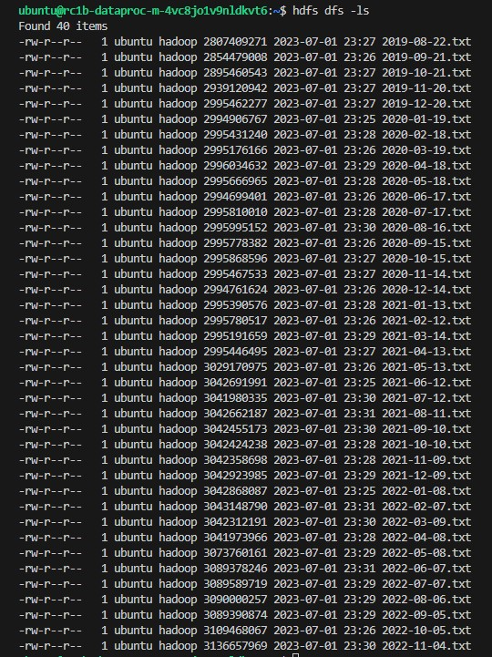

# Домашнее задание №1.

## Задание 1. Сформулировать цели проектируемой антифрод-системы в соответствии с требованиями заказчика
1. Минимизировать количество осуществленных мошеннических транзакций и денежный ущерб клиентов в системе онлайн платежей.
2. Не допустить оттока клиентов из системы онлайн платежей из-за корректных транзакций, по ошибке определенных антифрод-системой, как мошеннические.

## Задание 2. Аргументированно выбрать метрику машинного обучения, оптимизация которой, на Ваш взгляд, позволит достичь поставленных целей.

В среднем, доля фродовых транзакций среди общего количества транзакций очень мала и, как правило, не превышает и сотых долей процентов. Соответственно, мы имеем дисбаланс классов. Метрики AUC не зависят от соотношения классов и выбора определенного порога, поэтому в данной задаче лучше использовать одну из таких метрик. В частности, для данной задачи нам подойдет метрика **Precission/Recall**, т.к. в сравнении с ROC-AUC она более удобна для сравнения алгоритмов, когда нам не так важно определение большего класса (TrueNegative).

## Задание 3. Проанализировать особенности проекта.

Анализ по методике MISSION Canvas
 1. *Задача.* Разработать модель машинного обучения, способную в реальном времени оценивать является ли проводимая транзакция мошеннической.
 2. *Страхи.* 
- Не успеть сделать MVP за три месяца, чтобы дать руководству понять, что проект стоит развивать дальше
 - Не уложиться в выделенный бюджет
 - Не получится разработать модель, чтобы она соответствовала минимальным требованиям заказчика: общий ущерб клиентов за месяц < 500 т.р.; не более двух мошеннических транзакции на каждую сотню проведенных.
 - Модель не сможет выдержать нагрузку в предпраздничные дни
 - Доля корректных транзакций, классифицированных, как мошеннические, будет больше 5%
 - Система будет ненадежна и вероятность утечек будет слишком высока
 3. *Контекст.* Рост мошенничества при проведении онлайн-платежей, что создает большие сложности для валидации транзакций и негативно влияет на клиентский опыт.
 4. *Личные цели.* Разработка и продуктивизация качественной системы для выявления фродовых транзакций в реальном времени.
 5. *Новые умения.*
 - Навык разработки модели машинного обучения
 - Навык настройки инфраструктуры для модели
 - Самостоятельный вывод модели в продакшн
6. *Ради каких эмоций мы этим занимаемся.* Ради гордости за проделанную работу и повышения уверенности в собственных силах в разработки систем машинного обучения с нуля.
7. *Социальный фидбэк.* Хочу получить признания от коллег и специалистов в области машинного обучения.
8. *Альтернативы. Можно ли достичь поставленных целей другим путём.* Можно, но другой проект, который совмещает в себе все те профиты, которые перечислены выше, найти сложно.
9. *Выгода для клиента.* Клиенты получат возможность пользоваться надёжным сервисом онлайн-платежей без боязни стать жертвой мошенников, а банк получит большую денежную выгоду, если проект будет реализован
10. *Неотвратимость. Почему я не могу не заниматься этим проектом.*
- Я понимаю, что получу важные знания и опыт, завершив этот проект.
- Меньше людей станут жертвами мошенников.

## Задание 4. Декомпозиция системы.

Все функциональные модули находятся в облаке
1. Источники данных с новыми транзакциями
2. Библиотека/сервис для передачи real-time данных на вход сервиса для скоринга ml модели. Данные делятся на части
3. Сервис для скоринга ml модели (бинарный файл ml модели и скрипты для её запуска). Несколько инстансов запущены на нескольких серверах одновременно для отказоустойчивости и производительности. Каждый инстанс обрабатывает свою часть данных. Если один инстанс падает, другой берет на себя его работу
4. In-memory база данных для хранения результатов скоринга
5. Rest API для получения результатов скоринга из in-memory базы и отправки клиенту вердикта о транзакции
6. Сервис для получения, шифрования и сохранения данных о транзакциях в csv файлы на защищенном сервере

## Задание 5. Определение задач.

Задачи по принципу SMART

1. Подготовить первоначальный список необходимых сервисов в облаке и затраты на них в последующие 9 месяцев. Сумма затрат не более 6 млн. Срок - 2 дня.
2. Подготовить минимальную инфраструктуру необходимую для разработки модели в облаке. (настроить GitHub, создать репозиторий проекта, поднять in-memory базу данных, s3 хранилище для модели и ее артефактов, развернуть hadoop, spark, mlflow, kafka, настроить CI/CD). Срок - 2,5 недели.
3. Подготовить тестовые данные для обучения модели в размере 130 млн записей с соотношением фродовых транзакций ~0.01%. Срок - 1 неделя.
4. Обучить ml модель со значениями метрик Precision > 0.75 и Recall > 0.75. Срок - 1 месяц.
5. Написать скрипты для запуска обученной ml модели, способные скорить от 300 транзакций в минуту. Срок - 1 неделя.
6. Разработать простой REST API на FastAPI для отправки результатов скоринга клиенту. Срок - 1 неделя.
7. Разработать сервис для симметричного шифрования и сохранения данных за временной промежуток до недели о транзакциях в хранилище s3. Срок - 2 недели.
8. Показать и защитить MVP перед заказчиком. Срок - 1 день.
9. Улучшить показание метрик ml модели до Precision > 0.9 и Recall > 0.9, при этом доля FP (фродовые транзакции, определенные, как нефродовые) среди всех транзакций не должна превышать 0.02, а доля FN среди всех транзакций не более 0.05. Сумма потерянных клиентских денег за месяц не должна превышать 500 т.р.. Срок - 1,5 месяца.
10. Разработать распределенный сервис по параллельному скорингу модели, принимающий данные через kafka и способный выдавать результаты скоринга по 400 транзакциям в секунду. Срок - 1,5 месяц.
11. Разработать тестовое окружение для нагрузочного тестирования сервиса скоринга, способное отправлять запросы на скоринг до 2000 транзакций в секунду. Срок - 2 недели. 
12. Добавить ассиметричное шифрование в сервис сохранения данных о транзакциях. Срок - 1 неделя.
13. Если потребуется, доработать REST API отправки результатов клиенту, чтобы не было узкого горлышка при возвращении результатов скоринга клиенту. Срок - 1 неделя.
14. Разработать системные и интеграционные тесты и провести тестирование. Срок - 1 месяц
15. Исправление критических ошибок, мешающих корректной работе системы и нарушающих требований заказчика, если такие вдруг вскроются, если нет - исправление более мелких багов. Срок - 1 месяц

# Домашнее задание №2.

1. Точка доступа к бакету: s3://lbringerl-otus-mlops
2. Создать data proc кластер
3. Перенести данные с бакета на hdfs

4. Оценить стоимость поддержания работоспособности data proc кластера.
Оценить, насколько использование hdfs хранилища дороже объектного
HDFS хранилище ~ 26 т.р. в месяц
Объектное хранилище ~ 500 р. в месяц
Итог: примерно на 25.5 т.р. в месяц
5. Варианты оптимизации затрат на содержание кластера:
 - уменьшить гарантированную долю использования CPU, изменив тип хостов с "standard" на "burstable". Уменьшение затрат с 26 т.р. до 9 т.р. в месяц
 - поменять архитекутуру хостов на intel cascade lake и выбрать конфигурацию b2.small. Уменьшение затрат с 9000 р. в месяц до 7.800 р. в месяц
6. Изменить стаус задач на kanban доске
7. Удалить data proc кластер
